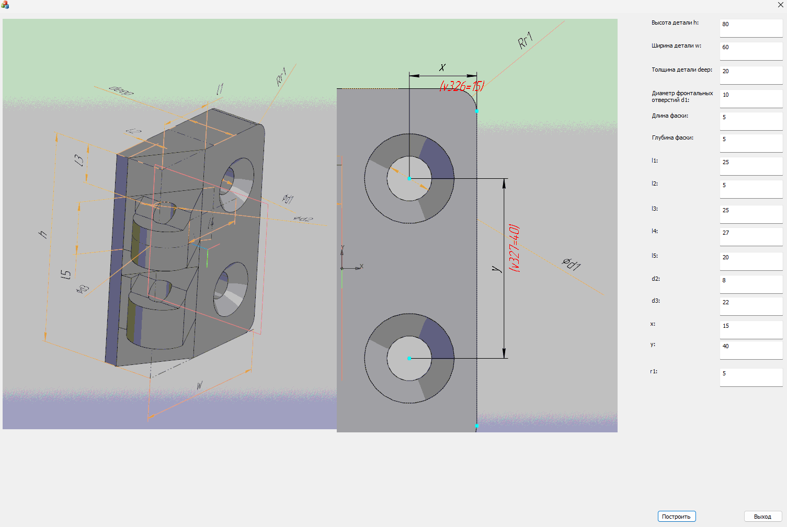

# Проект: Параметрическая сборка дверной петли в КОМПАС 3D с использованием MFC

## Описание проекта
Этот проект представляет собой MFC приложение на C++, разработанное для создания параметрических сборок дверных петель в приложении КОМПАС 3D.

## Особенности

- **Интеграция с КОМПАС 3D**: Проект взаимодействует с API КОМПАС 3D для построения выбранной дверной петли в приложении.

## Использование
1. **Настройка параметров**: В диалоговом окне параметров укажите размеры, типы крепежа и другие характеристики.
2. **Построение**: Нажмите кнопку "Построить", чтобы создать параметрическую сборку дверной петли в КОМПАС 3D.

## Требования к среде разработки
- **Visual Studio**: Проект разработан с использованием Visual Studio.
- **КОМПАС 3D API**: Необходима установленная библиотека или API КОМПАС 3D для взаимодействия с приложением.

## Скриншоты

